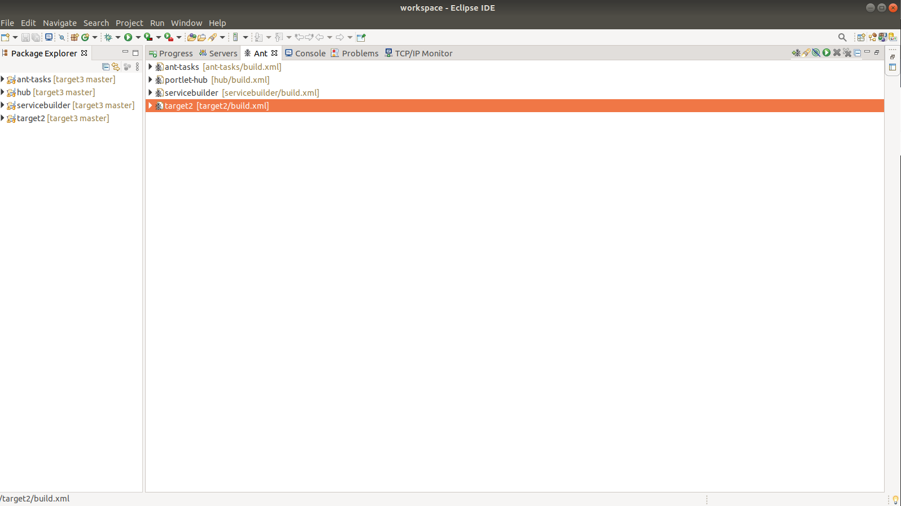
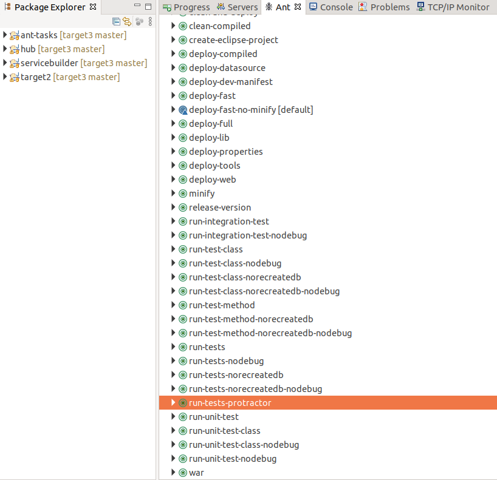
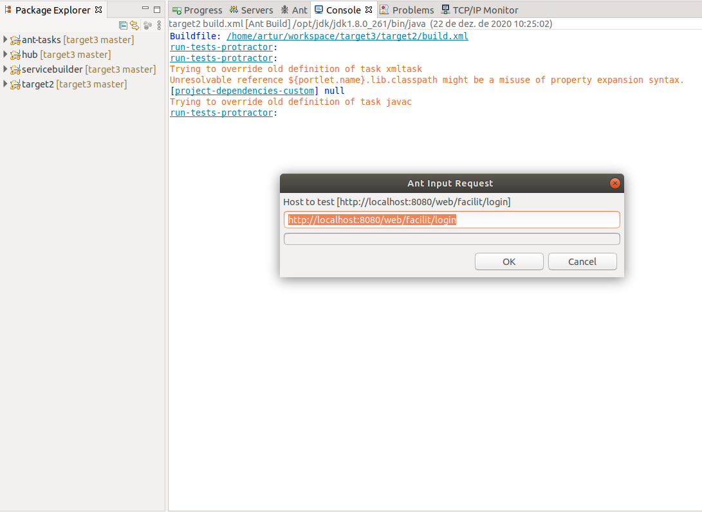
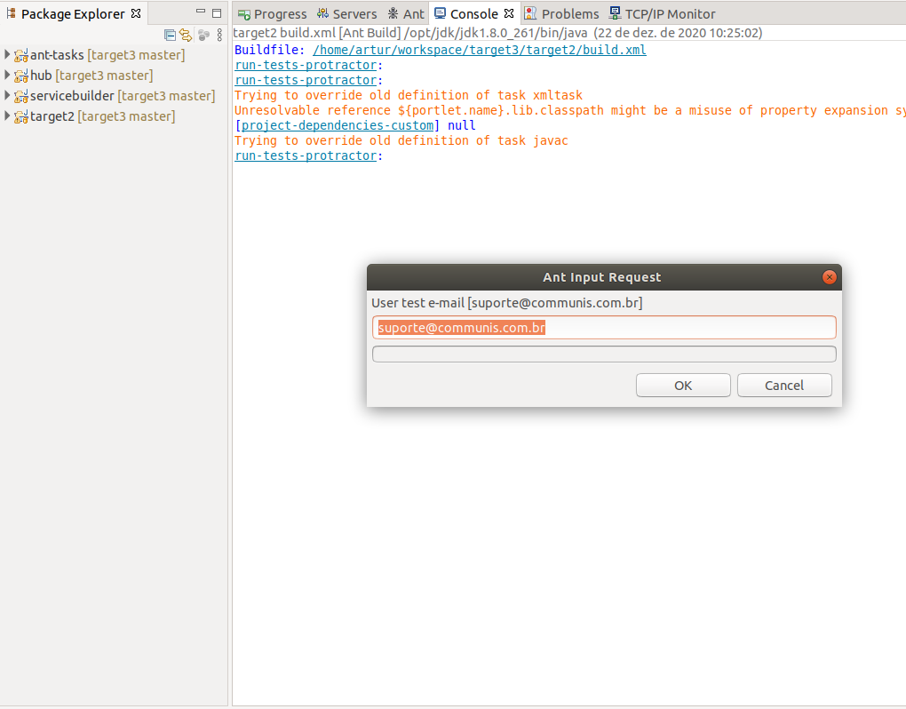
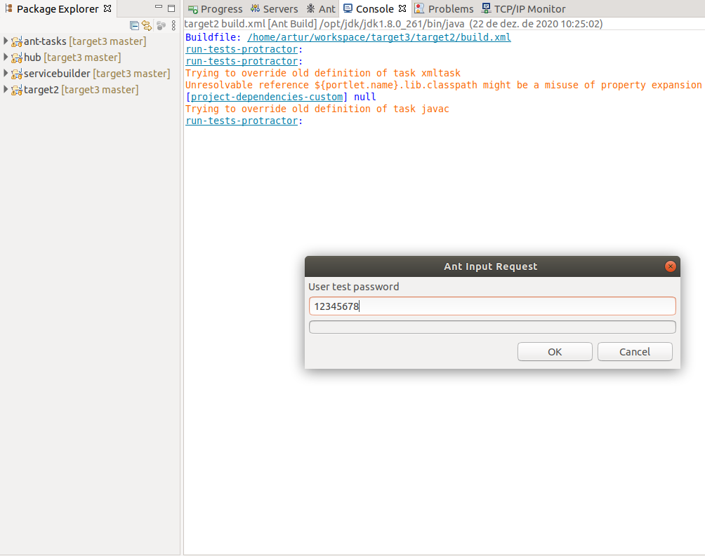
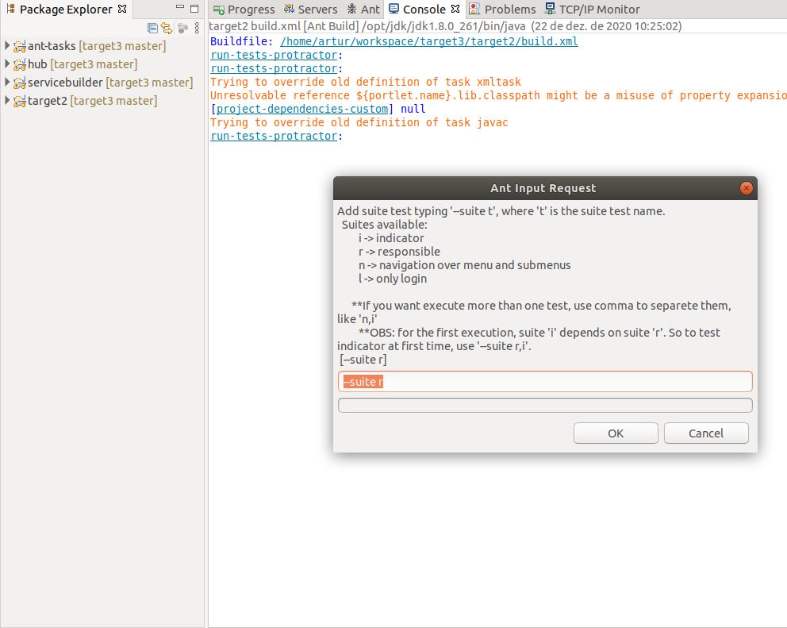

# Run Tests in Protractor
##### Let's doing
---
The README is considered the prerequisites expected below for the execution protractor:
  - [Ubuntu 18.04.5 LTS (Bionic Beaver)](https://releases.ubuntu.com/18.04)
  - [Chrome WebDriver](https://dl.google.com/linux/direct/google-chrome-stable_current_amd64.deb)
  - [Install Node, Npm, Protractor and Protractor-Beatiful-Reporter](https://github.com/facilit/target3/wiki/Tutorial-Instala%C3%A7%C3%A3o)
  - [Enviroment Run ](https://github.com/facilit/target3/wiki/Enviroment-Util)
---

### Run in the eclipse workspace
#####   1. Enter the Ant Tab


#####   2. Click in run-tests-protractor


#####  3. Enter url of login domain or Click OK for default 


#####  4. Enter email to login or Click OK for default


#####  5. Enter password to login


#####  6. Enter the suite of test or  Click OK for default


---

### Run in terminal linux
#### Wherever the ❯ icon is considered input for commands:
```sh
artur in ~
❯ 
```
####   1. Change directory for workspace of target3/target2, in this example my workspace directory is:
```sh
artur in ~
❯ cd /home/artur/workspace/target3/target2
```
####   2. Type on terminal and press Enter for execute
```sh
artur in target3/target2
❯ ant run-tests-protractor
```

####  3. Enter url of login domain or press Keyboard Enter for url default [localhost](http://localhost:8080/web/facilit/login)
```sh
artur in target3/target2
 ant run-tests-protractor
Buildfile: /home/artur/workspace/target3/target2/build.xml

run-tests-protractor:

run-tests-protractor:
Trying to override old definition of task xmltask
Unresolvable reference ${portlet.name}.lib.classpath might be a misuse of property expansion syntax.
[project-dependencies-custom] null
Trying to override old definition of task javac

run-tests-protractor:
    [input] Host to test [http://localhost:8080/web/facilit/login]
❯
```

####  4. Enter email to login or press Keyboard Enter for url default
```sh
    [input] Host to test [http://localhost:8080/web/facilit/login]

    [input] User test e-mail [suporte@communis.com.br]
❯  
```

####  5. Enter password to login
```sh
    [input] Host to test [http://localhost:8080/web/facilit/login]

    [input] User test e-mail [suporte@communis.com.br]

    [input] User test password
❯  
```
####  6. Enter the suite of test
```sh
run-tests-protractor:
    [input] Host to test [http://localhost:8080/web/facilit/login]

    [input] User test e-mail [suporte@communis.com.br]

    [input] User test password

    [input] Add suite test typing '--suite t', where 't' is the suite test name. 
    [input]   Suites available: 
    [input]          i -> indicator 
    [input]          r -> responsible 
    [input]          n -> navigation over menu and submenus 
    [input]          l -> only login 
    [input]  
    [input]       **If you want execute more than one test, use comma to separete them, like 'n,i' 
    [input]          **OBS: for the first execution, suite 'i' depends on suite 'r'. So to test indicator at first time, use '--suite r,i'.
    [input]  [--suite r]
❯   --suite n,i,r
```

License
----
MIT